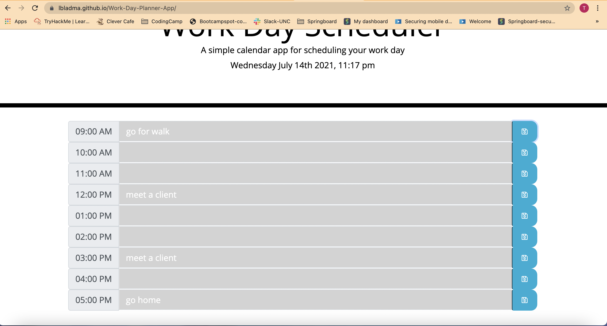
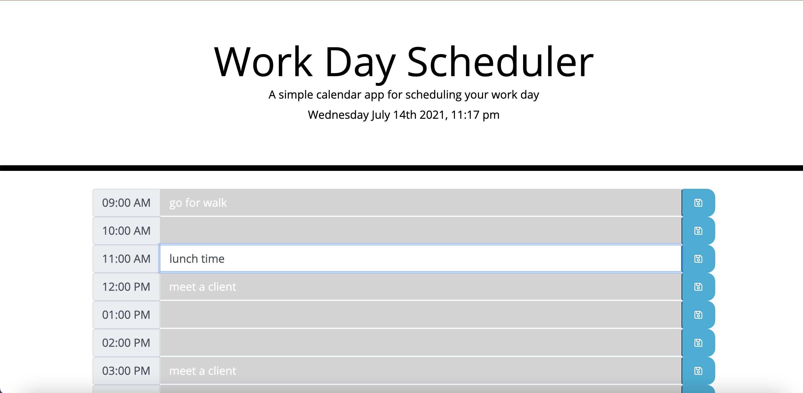

# Synapsis of the Day Planner project
#### This project is for creating a simple calendar application that allows a user to save events for each hour of the day by modifying starter code. 
#### This app will run in the browser that features dynamically updated HTML and CSS powered by jQuery.

####
#

# Summary of the Day Planner project  functionalities and tools
* Tools and functionality used are: jQuery, LocalStorage, Moment.js, Bootstrap, HTML, CSS and Javascript d
* This project uses Javascript to save and retrieve information or data from local storage
* This app depends on the use of moment.js for time calculation and formatting  conversion 
* Users are able to plan their schedule and workday 
* A 9 to 5 schedule an hour block is used to allow users to save their activities in a calendar format
#
# The Deployed App screenshot
#

#
# The URL to the Depolyed app
* Here is the URL to the deployed app

https://lbladma.github.io/Work-Day-Planner-App/

# The URL of the GitHub repository
* Here is the URL to the deployed app

https://github.com/lbladma/Work-Day-Planner-App